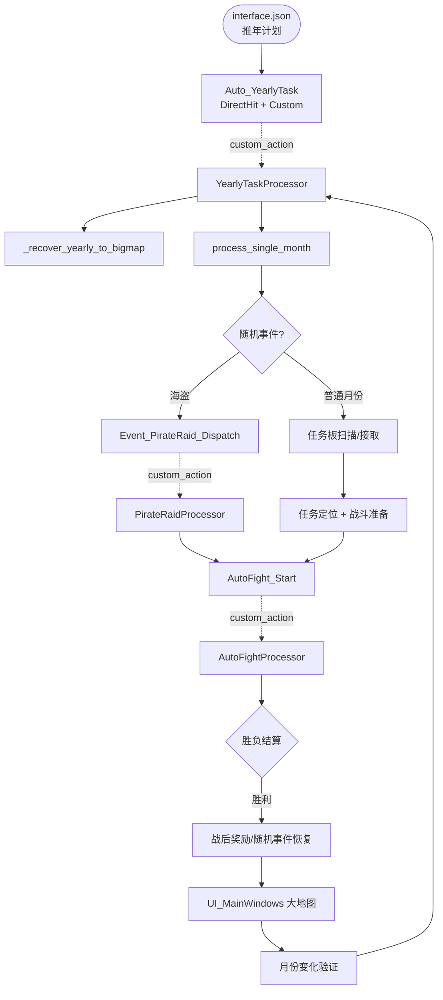
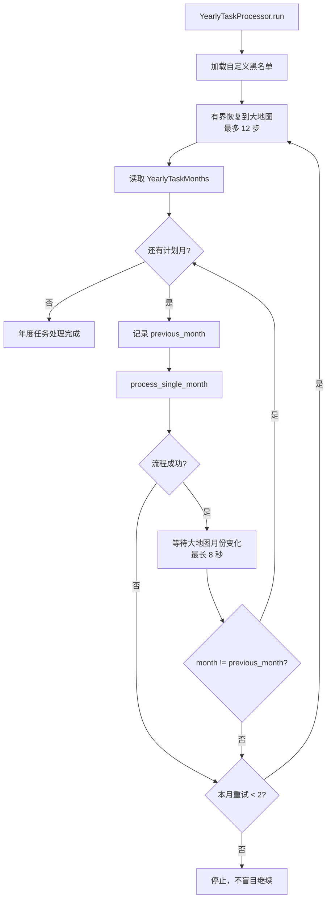
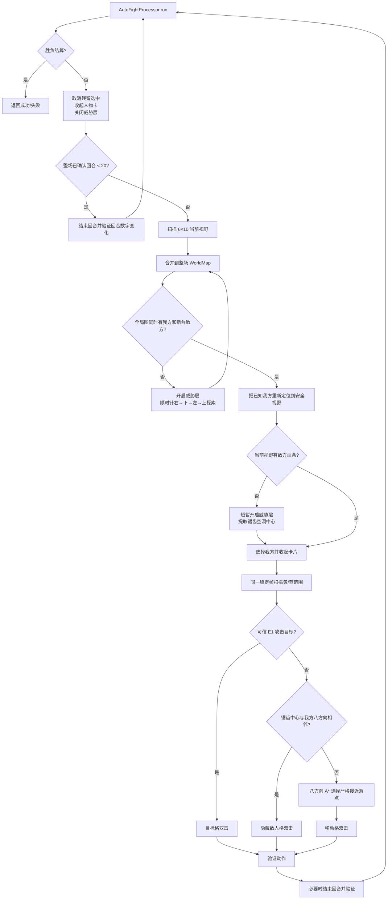
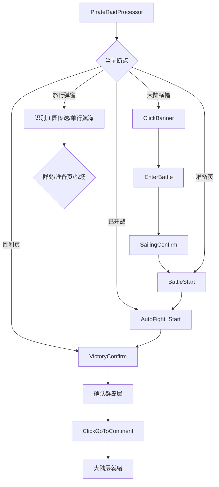

# 自动推年与战斗系统分析

本文档记录当前 `推年计划` 的真实执行结构，重点说明 Pipeline 节点、Python Agent、战场局部/全局建图、八方向 A*、隐藏敌人识别、海盗事件和失败恢复。内容以当前源码和 2026-08-03 的 60 个月实机长跑为准。

## 1. 最终结果

- 当前关卡和最后一场海盗战均已完成。
- 累计计划月数为 `10 + 1 + 8 + 11 + 3 + 27 = 60`。
- 最后一场海盗事件开始前为 9 月，完成后大地图表盘为 10 月；没有额外执行第 61 个普通月。
- 最终安装配置已恢复为 `推年计划 / 60个月`。
- 完整自动化测试为 34 个，全部通过；Python 编译、Pipeline 资源加载和 `git diff --check` 也通过。

## 2. 三层结构

系统不是单一 Pipeline 状态机，而是三层协作：

1. `interface.json` 暴露用户任务和运行选项。
2. Pipeline JSON 负责可观察、可点击的原子节点。
3. Python CustomAction 负责有状态编排、循环、恢复、建图和决策。



图中虚线表示 Pipeline 的 `custom_action` 进入 Python；普通实线表示 Python 内部编排或状态推进。完整的自动生成关系图位于 `docs/zh_cn/graph/index.html`。

## 3. 关键 Pipeline 节点

| 文件 | 节点 | 类型 | 作用 |
|---|---|---|---|
| `auto_task.json` | `Auto_YearlyTask` | `DirectHit + Custom` | 进入 `YearlyTaskProcessor` |
| `auto_task.json` | `YearlyTaskMonths` | OCR 配置节点 | 由 interface option 覆盖计划月数 |
| `auto_task.json` | `OpenCityTaskPanel` | `next` / `[JumpBack]` | 识别任务板，必要时调用找任务、切城、进城子流程 |
| `city.json` | `FindCityTask_OCR` | OCR | 判断任务板状态 |
| `city.json` | `FindCityTask_SwipeUp` | Swipe | 先回到任务列表顶部 |
| `city.json` | `FindCityTask_SwipeDown` | Swipe | 从上到下扫描任务池 |
| `city.json` | `FindCityTask_Refresh` | OCR + Click | 整池无合法任务时刷新一次 |
| `city.json` | `FindCityTask_RefreshConfirm` | OCR + Click | 确认 10 水晶刷新 |
| `fight_utils.json` | `AutoFight_Start` | `DirectHit + Custom` | 进入 `AutoFightProcessor` |
| `city.json` | `FightEndRound` | TemplateMatch + Click | 结束当前回合 |
| `city.json` | `FightVictory` / `FightFail` | 持久状态识别 | 战斗唯一可信终态 |
| `battle_grid.json` | `Battle_UnitScan_Blue/Red/Green` | ColorMatch | 识别我方、敌方、友军状态条 |
| `battle_grid.json` | `Battle_MoveRange` | ColorMatch | 识别蓝色移动格 |
| `battle_grid.json` | `Battle_AttackRange` | ColorMatch | 识别黄色攻击格和角标 |
| `battle_grid.json` | `Battle_ThreatRegion` | ColorMatch | 识别红色威胁覆盖区 |
| `battle_grid.json` | `Battle_ThreatToggleOn` | 状态识别 | 验证威胁层是否开启 |
| `battle_grid.json` | `Battle_MapPan*` | Swipe | 右、下、左、上及四个对角方向的地图探索 |
| `event_utils.json` | `Event_PirateRaid_Dispatch` | `DirectHit + Custom` | 进入 `PirateRaidProcessor` |
| `event_utils.json` | `Event_PirateRaid_ClickBanner` | OCR + Click | 点击海盗横幅 |
| `event_utils.json` | `Event_PirateRaid_EnterBattle` | OCR + Click | 进入海盗战斗 |
| `event_utils.json` | `Event_PirateRaid_SailingConfirm` | OCR + Click | 确认前往瑞格群岛 |
| `event_utils.json` | `Event_PirateRaid_BattleStart` | OCR + Click | 从准备页开始战斗 |
| `event_utils.json` | `Event_PirateRaid_VictoryConfirm` | OCR + Click | 处理战利品/经验确认页 |
| `city.json` | `ClickGoToArchipelago/Continent` | OCR + Click | 大陆与群岛层切换 |

### 3.1 `next` 与 Python 调用的边界

海盗的四个动作节点现在是原子的：

- `Event_PirateRaid_ClickBanner`
- `Event_PirateRaid_EnterBattle`
- `Event_PirateRaid_SailingConfirm`
- `Event_PirateRaid_BattleStart`

它们不再通过自己的 `next` 自动跑完整条链。唯一编排者是 `PirateRaidProcessor`，从而避免“Pipeline 已跑完整场战斗，Python 又重复点击进入战斗”的双重调度。

`Event_PirateRaid_VictoryConfirm` 保留自循环和 `[JumpBack]Event_PirateRaid_ArchipelagoBack`：前者连续处理多个确定页，后者是执行后返回的子例程，不是永久状态转移。

## 4. 年度任务主循环



关键安全约束：

- 每个月开始前都先恢复到大地图。
- 月份必须在稳定大地图上识别，而且必须发生变化，才计为完成。
- 单月最多重试 2 次；恢复最多 12 个状态步骤。
- 未知画面、战斗失败页或重复事件无变化时停止，不继续盲点。

## 5. 普通月任务板流程

任务板不是只扫当前屏幕：

1. 连续执行 5 次 `FindCityTask_SwipeUp`，把上个月遗留的滚动位置复位到顶部。
2. 从顶部开始扫描当前页，再最多向下滑 5 次，共观察 6 个视口。
3. `TaskHudRecognizer` 过滤黑名单、保护任务、非战斗任务和超过 120 级的任务。
4. 找到合法任务后点击该任务自己的接受按钮坐标。
5. 若整个任务池都没有合法任务，只允许执行一次 `FindCityTask_Refresh`。
6. 刷新会弹出确认页，实机验证消耗 10 水晶；确认后重新从顶部扫描一次。

这个限制避免任务板在底部原地滑动，也避免无限刷新消耗资源。

## 6. 战斗 Agent 总流程



### 6.1 为什么前 20 回合统一被动

所有任务统一先结束 20 回合，让敌人主动接近并依赖我方反击。回合数存放在 `BattleSessionState`，同一个进程内由外层恢复重新进入 `AutoFightProcessor` 时不会重新等待 20 回合。

测试时可通过 `MAAGC_TEST_ACTIVE_FROM_ROUND` 提前进入主动阶段；正式默认值仍是 21 回合开始主动搜索。

### 6.2 6×10 局部网格

- 屏幕按 `10 行 × 6 列` 划分，每格约 `120×120` 像素。
- `GridScanner` 同帧识别单位状态条、移动格、攻击格和攻击角标。
- 单位点击优先使用真实状态条或范围角标中心，不直接假设静态格心。
- 移动和攻击都执行同一点两次：第一次生成预览，第二次提交；两次间隔 0.2 秒，提交后等待 0.5 秒稳定。

## 7. 持久世界地图与顺时针探索

`battle_world_map.py` 提供整场战斗都保留的 `BattleWorldMap` 和 `BattleSessionState`。

持久状态包括：

- 当前相机世界原点 `camera_origin`。
- 已观察格 `observed`。
- 我方、敌方、环境目标及其最后观察回合。
- 阻挡格、地图边界和已预测的我方移动。
- 最近移动点、最后移动方向、无进展次数和已确认回合数。

每次滑动后通过画面相位相关结果确认镜头是否真实移动，再更新世界原点。滑到不能继续时记录方向边界，而不是无限重复滑动。

顺时针探索次序固定为：

```text
右 → 下 → 左 → 上
```

每次移动镜头后立即扫描并合并局部视野。一旦全局图同时拥有我方和新鲜敌方目标，就提前结束探索，不必强制走完整圈。四个对角 Pan/Nudge 节点用于边缘单位或边缘目标重定位。

## 8. 隐藏敌人的识别

隐藏敌人可能完全没有红色生命条，但威胁层持续存在。识别分两级：

1. 大块连续威胁区域只提供粗方向，不直接当敌人格。
2. 在 120 像素对齐网格中寻找“中心红色覆盖低、周围多个邻格红色覆盖高”的锯齿空洞，把空洞中心确认为敌人格。

确认的锯齿中心写入世界地图，并可转换为当前视野坐标。普通红条、锯齿中心和环境目标使用不同新鲜度，避免旧动态坐标长期污染规划。

### 8.1 本次死循环根因与修复

实机故障现场中：

- 我方在 `(5,3)`。
- 锯齿中心敌人在 `(5,2)`，两者相邻。
- 敌人无血条，人物立绘遮住黄色攻击角标。
- A* 正确判断我方已经处于攻击环，因此拒绝绕行。
- 旧逻辑又要求 E1 黄色角标才能攻击，于是连续结束回合。

当前修复只在以下条件全部成立时触发：

- 本回合威胁层刚确认了精确锯齿中心；
- 锯齿中心仍能映射到当前局部网格；
- 所选我方与中心的 Chebyshev 距离恰好为 1，即八方向相邻；
- 当前没有更可信的普通 E1 攻击目标。

此时直接对锯齿中心双击。远端世界地图记忆、同格坐标和隔两格坐标都不会走该分支。

实机续战中该分支连续命中三次，最后识别到胜利页。

## 9. 八方向 A* 追击

规划目标不是敌人格本身，而是敌人周围的八方向攻击环。

- 直线步长代价为 10，对角步长代价为 14。
- 未探索格有额外代价，但不是绝对禁止。
- 对角移动若两个侧向格都被阻挡，则禁止穿角。
- 候选移动格必须严格降低到攻击环的路径代价。
- 最近落点和上次方向参与排序，减少来回横跳。
- 如果我方已经在攻击环，A* 返回 `None`，不会绕着敌人转圈。

当前回合若只拿到远端方向，系统会选择方向投影最大但不越过目标的蓝格；确认移动成功后立即停止调度其余角色，结束本回合并重新建图。

## 10. 动作验证

控制器“点击成功”不等于游戏动作成功。系统使用以下证据：

| 动作 | 成功证据 |
|---|---|
| 攻击 | 敌方红色状态像素明显减少 |
| 隐藏敌人攻击 | 局部红色像素减少、回合变化或胜利页 |
| 移动 | 选中角色菱形行动点从原格到目标格，或清层后我方状态条到达预测位置 |
| 自动换回合 | 右下角常驻回合数字连续稳定变化 |
| 战斗结束 | `FightVictory` 或 `FightFail` 持久结算页 |

整屏变化、范围层消失和 Pipeline 节点被尝试过都不能单独作为成功证据。

## 11. 海盗事件状态机



恢复入口支持大陆横幅、旅行弹窗、群岛层、战斗准备页、已开战和胜利页。旅行弹窗必须明确包含“瑞格群岛”，通用“提示”弹窗不会再被误当成海盗航海弹窗。

层切换必须看到无遮挡的就绪节点：

- 群岛层：`ClickGoToContinent`。
- 大陆层：`ClickGoToArchipelago` 或 `EnterCity`。

底层地图按钮可能先于旅行弹窗出现，因此就绪判断有延迟窗口，并且弹窗存在时不接受背景按钮命中。

## 12. 有界恢复与停止条件

| 场景 | 边界 |
|---|---|
| 年度月份重试 | 每月最多 2 次 |
| 年度状态恢复 | 最多 12 步 |
| 战后中断事件 | 最多 8 步 |
| 主动战斗连续无验证动作 | 12 回合后返回外层恢复 |
| 主动战斗总动作循环 | 300 次安全熔断 |
| 海盗层切换等待 | 单段 10 秒 |
| 敌人方向记忆 | 最多沿用 6 回合 |

外层恢复能重新接管准备页、战场、胜利页、旅行弹窗、海盗事件、普通弹窗和可返回页面。重复处理同一事件仍无画面变化时停止。

## 13. 本轮修复清单

| 问题 | 修复 |
|---|---|
| 隐藏敌人无血条，左右/原地等待 | 威胁锯齿中心持久建图；相邻时允许直接双击 |
| 只靠局部方向追击 | 顺时针全局建图 + 八方向 A* |
| 地图边缘单位/目标不可点击 | 四方向和四对角重定位，真实镜头位移验证 |
| 海盗 Pipeline 与 Python 重复跑链 | 四个海盗动作节点原子化，Python 单一编排 |
| 海盗旅行 ROI 错位 | 修正确定按钮 ROI，并用“瑞格群岛”限定弹窗 |
| 海盗胜利确认 ROI 过低 | 扩大到实际确定按钮区域 |
| 任务板停在列表底部 | 每次先向上复位，再完整向下扫描 |
| 任务池全是黑名单/非战斗任务 | 有界刷新一次，再扫描；实机验证消耗 10 水晶 |
| 战后丰收节、佣兵生娃等中断 | 战后恢复循环识别并处理事件后再确认大地图 |

## 14. 验收证据

- 27 个月续跑日志：`install-cli/debug/maa-27m-resume-20260803-063256.stderr.log`
- 最后一场隐藏敌人修复实机日志：`install-cli/debug/maa-final-pirate-20260803-071717.stderr.log`
- 最终任务成功输出：`install-cli/debug/maa-final-pirate-20260803-071717.stdout.log`
- 故障现场截图：`screenshot_20260803_071028_492953.png`
- 最终大陆大地图截图：`screenshot_20260803_072014_914395.png`
- 自动生成 Pipeline 图谱：`docs/zh_cn/graph/index.html`

最终实机日志中的关键序列为：

```text
确认锯齿空洞敌人格: local=[(5, 2)]
相邻锯齿威胁中心虽无黄色角标，直接双击攻击格子: (5, 2)
攻击确认成功
识别到战斗胜利结算页
恢复大陆：当前已经在大陆层
=== 海盗袭击庄园事件完成 ===
```

## 15. 主要源码入口

- `agent/action/fight/fight_processor.py`：年度循环、月份校验、事件恢复。
- `agent/action/fight/fight_utils.py`：任务板、开战、战后流程。
- `agent/action/fight/pirate_raid_processor.py`：海盗跨图断点编排。
- `agent/action/zshg/auto_fight_processor.py`：战场识别、探索、选择、攻击、移动、验证。
- `agent/action/zshg/battle_grid.py`：6×10 局部网格和单位/范围识别。
- `agent/action/zshg/battle_world_map.py`：持久世界地图、顺时针探索、八方向 A*。
- `assets/resource/base/pipeline/auto_task.json`：年度任务 CustomAction 入口。
- `assets/resource/base/pipeline/battle_grid.json`：战场识别与镜头动作节点。
- `assets/resource/base/pipeline/city.json`：任务板、战斗终态和地图切层节点。
- `assets/resource/base/pipeline/event_utils.json`：事件和海盗原子节点。
